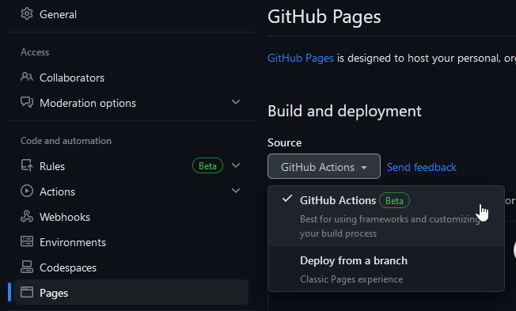

# markdown-to-pages-action

Turn your README(s) into a basic static site.

Only HTML files and a single `index.css` file are rendered. The only
JavaScript included controls the dark-mode toggling feature.

## Limitations

Only one README is allowed per directory. README files are rendered as an
`index.html` for that directory and no logic exists to automatically determine
which file should be that directory's `index.html`.

## Inputs

### `token`

**Required:** A token is required to communicate with the Github API

### `files`

Markdown files to render (*default: ***ROOT `README.md`****). Delimit multiple
files with new-lines.

### `out_path`

Path the rendered files will be output to (*default: ***`dist`****)

### `out_path_not_empty`

Sets whether any files are expected to be in the output directory
(*default: ***`'false'`****)

Unless set to `'true'`, this Action will error if the output directory has any
files or directories in it. This is to prevent unintended overwriting of any
files.

### `title`

Title of the page (*default: ***`username/repository`****)

## Example usage

In your repository, under `Settings`>`Pages`, ensure that `Source` is set to
`Github Actions`.



```yaml
jobs:
  build:
    steps:
    - uses: actions/checkout@v4
    - uses: wranders/markdown-to-pages-action@v1
      with:
        token: ${{ secrets.GITHUB_TOKEN }}
        files: |-
          README.md
          test/README.md
          test/nested/readme.md
    - run: cp ./images ./dist/images/
    - uses: actions/upload-pages-artifact@v3
      with:
        path: dist

  deploy:
    needs: build
    permissions:
      pages: write
      id-token: write
    environment:
      name: github-pages
      url: ${{ steps.deployment.outputs.page_url }}
    steps:
    - uses: actions/deploy-pages@v4
      id: deployment
```

Only HTML and CSS are created. If your README references seperate resources like
images, those directories will have to be copied to the `out-path` separately.

## Credits

This project is ***heavily*** inspired by
[aleen42/markdown-only](https://github.com/aleen42/markdown-only). In fact, all
of the rendered styling is based on their work. The motivation for this project
was to not have to include all of the Jekyll files in repositories I wanted to
use that Pages style for and leverage Actions.

An improvement made here over the original project is that Github CSS is pulled
from Github's published `npm` Node Packages instead of curated. The downside is
a larger stylesheet, though this may be addressed in a later release.

## Multi-page Demo

Here is a link to [`test/README.md`](./test/README.md). Here's another link to
[`test/nested/readme.md`](./test/nested/readme.md). Here's a deeply nested link
to [`test/nested/twice/README.md`](./test/nested/twice/README.md). This shows
how multiple pages will be handled.
